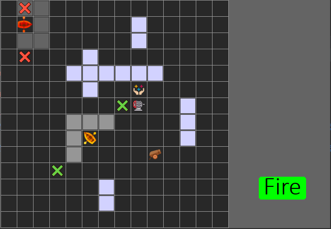

# Deep Reinforcement Learning in a Boat Game
## Authors: Lorenzo Mandelli
#### Università degli Studi di Firenze

---

## Installation

The project need the following libraries: 
* Tensorflow 2.2.0
* Tensorforce 0.5.5

The latest versions of the remaining required libraries (*matplotlib, numpy, pandas, pygame, pygame-widgets, tabulate*) can be used.

In addition, the backups of the agents and the framework necessary to use them can be found at this [Link](https://drive.google.com/drive/folders/1-h5oJv1MsJ-lxjT5vHgujoqfLluG1l5a?usp=sharing "files")

## Usage

In order to run the program simply run *python3 main.py*.
 
 
 
The following is the original abstract of the project.

---

# Project Abstract 
*The scope of this paper is to verify if appropriate Deep Reinforcement Learning strategies can prove effective for the realization of non-player characters in a video game such as to have a credible behavior and able to provide a pleasant and stimulating game challenge for the user. 
For this purpose, a turn-based roguelike prototype has been created in which the adversary agents are made through DRL methods through the framework created by Alessandro Sestini, Alexander Kuhnle and Andrew D. Bagdanov. 
The agents obtained were tested quantitatively and qualitatively in order to determine if their final behavior was convincing according to the set objectives. Finally, an evaluation was given to the framework used to create the agents.* 

All information on the project is reported in the [*relazione.pdf*](https://github.com/divanoLetto/Reinforcement_learning-a_Boat_Game/blob/main/relazione.pdf "relazione.pdf")  file. 
